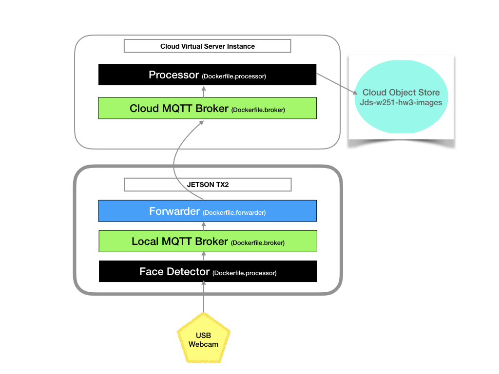

# w251-hw3 - Homework 3  
  
## Overview
Thhis repo contains the components of a lightweight IoT application pipeline that collects images of faces detected from a webcam feed on an edge device (the Nvidia Jetson TX2) and transmits them to the cloud to be processed and stored (an IBM CLoud Object Store).   
  
## Implementation Details  
All components are implemented as containerized applications deployed on the edge device (to capture and forward image) and the cloud (to receive, process and store). MQTT protocol is used for communication and transmitting images across components.  

### Overall Architecture  

  
### Jetson 
3 component containers:  
- Local MQTT Broker
- Face Detector: captures faces from video feed and publishes to local broker (Topic: JDS/WEBCAMS/JETSONTX2)
- Forwarder: Subscribes to messages from Face Detector and publishes to cloud broker (Topic: JDS/WEBCAMS)

### IBM CLoud  
2 component containers running in a VSI:
- Cloud MQTT Broker
- Processor: subscribes to messages coming from the Jetson (or any device usig topic JDS/WEBCAMS) 

Mount an IBM Objectstore bucket (jds-w251-hw3-images in our case) to the `/HW3Images` directory  

### Docker  
3 distinct docker build files are used (Dockerfile.broker, Dockerfile.forwarder and Dockerfile.processor).   
#### Build Images for the Cloud:  
Broker: `docker build -t hw3_broker -f Dockerfile.broker .`  
Image Processor: `docker build -t hw3_processor -f Dockerfile.processor .`  
   
#### Build Images for the Jetson  
Broker: `docker build -t hw3_broker -f Dockerfile.broker .`  
Forwarder: `docker build -t hw3_forwarder -f Dockerfile.forwarder .`  
Edge Image Detector: `docker build -t hw3_edge -f Dockerfile.processor .`  
  
## MQTT messaging with Mosquitto  
Few noteworthy points on the MSQTT setup:  
- The topic used locally on the JETSON is /JDS/WEBCAMS/JETSONTX2. The topic published to in the cloud is /JDS/WEBCAMS/, the thinking being thaht the forwarder could be working as an "accumulator" of sorts,gathering messages from multiple webcams.  
- I used a QoS of 0 when publishing from the face capture app locally to the forwarder since the connection is all local to the Jetson and a few missing messages are not relevant given the rate at which pictures are being captured from the camera.  
- I used a QoS of 1 (forwarder publishes, cloud processor subscribes) to send the encoded messages to the cloud. Transmission in this case is likely less reliable than just within the Jetson. Since this use case does not care about duplicate images being stored, I did not use QoS of 2 (which would have guaranteed one and only one message).  
  

### Python Scripts  
3 scripts included in the repo:  
- edge_detect.py: Runs on the  Face Detector to capture face images and publish them to the JDS/WEBCAMS/JETSONTX2 topic.  
- forward.py: Runs on the Forwarder , subscribes to messages locally on the JDS/WEBCAMS/JETSONTX2 topic nad publishes them to the cloud broker under the JDS/WEBCAMS topic.  
- imageprocess.py:  Runs on the cloud VSI -> Processor. Saves incoming messages (from JDS/WEBCAMS) to the /HW3Images directory (which in our implementation is mapped to an IBM COS bucket).  

## Execution Instructions  

### In the CLoud VSI:  
Create a user-defined Docker network: `docker network create --driver bridge hw03_jds`  
Initiate the cloud MQTT Broker: `docker run --name hw3_broker --privileged -tid --rm -p 1883:1883 --network hw03_jds hw3_broker`  
Initiate the Image Processor: `docker run --name hw3_processor -v /HW3Images:/HW3Images -v /home/Projects/w251-hw3:/host --privileged -ti --rm --network hw03_jds hw3_processor python /host/imageprocess.py`  
  
### On the Jetson TX2:  
Create a user-defined Docker network: `docker network create --driver bridge hw03_jds`  
Initiate the local MQTT Broker: `docker run --name hw3_broker --privileged -tid --rm -p 1883:1883 --network hw03_jds hw3_broker`  
Launch the Edge Detecor: `docker run --name hw3_edge -e DISPLAY=$DISPLAY --privileged -v /usr/share/opencv4:/OpenCV -v /tmp:/tmp -v /home/nvidia/Documents/Projects/HW3:/host --rm --env QT_X11_NO_MITSHM=1 -ti --network hw03_jds hw3_edge python /host/edge_detect.py`  
Launch the Forwarder: `docker run --name hw3_forwarder -v /home/nvidia/Documents/Projects/w251-hw3:/host --privileged -ti --rm --network hw03_jds hw3_forwarder python3 /host/forward.py`  
  
The usb webcam for the TX2 should now start capturing faces and sending it to the cloud where it gets stored in the COS bucket mounted at /HW3Images  
  
## Sample Images    
  
Captured images (in COS Bucket: jds-w251-hw3-images):   https://s3.au-syd.cloud-object-storage.appdomain.cloud/jds-w251-hw3-images  
  
Some sample images also included:    

## Conclusion
While this project does have a working End to End flow for image detection at teh edge, with transmission to and storage on the cloud... a few things that could be worked on (given more time) to improve the seamlessness of the implementation:  
1. Use docker-compose to make set up/ teardown (both on the cloud VSI and the Jetson) simpler (i.e. less steps)  
2. Have a more graceful way to stop image capture , transmission and storage. This could be accomplished by using a time limit or a "shutdown" topic that the Edge Detector , Forwarder and Processor subscribe to.  
3. Live feedback of faces being captured (in debug mode) on the Jeston (would require external monitor to be attached) with rectangles on the faces being captured overlayed in the video feed.  

